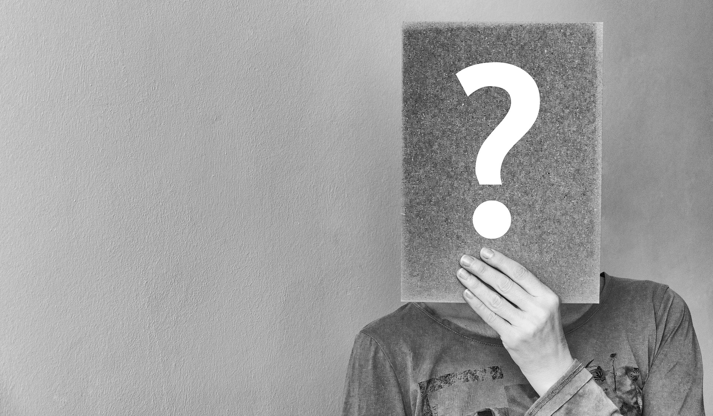

There is always a ‘but’ to every single thing.

I feel like clubbing my orange top with yellow pants for an outing but …
I want to take a sabbatical from work and do nothing for a few months but …
I realized that I want to make a switch from my Software developer profile to Fashion designer but …
I don’t have any plans for marriage but …
I don’t want to join Friday’s party but …
I want to be myself forever but …
Have you ever gone through these kinds of thoughts? Great, if you haven’t but if you have had these kinds of thoughts in the back of your mind ever, you will realize how difficult it is to let go of “others” thought. Well, this single thought in your mind has the power to make things go the other way which you might not like. I think we do it more when we are not confident about ourselves. Somehow, we have developed this fear in our minds and never realize that it can be eradicated. But the question is, can we really afford the time to give a thought about what others are thinking about our behavior, attires, status etc? Do we even realize that we miss out some exciting opportunities if keep on thinking about what other’s will think? If Sir Issac Newton had thought about “what others will think” and had thought nothing about falling of an apple from the tree, we wouldn’t have the theory of gravity with us today. If Mahatma Gandhi had feared about British rule in India and dared not to do anything, we wouldn’t have the history that says all about freedom movement in India which had some brilliant person like him. If Jack Ma had feared of rejections and people multiple times, he wouldn’t have the guts to set-up Alibaba. If J.K Rowling had not tried for the 13th time for her book “Harry Potter and the Philosopher’s Stone”, we wouldn’t have those amazing Harry Potter series that totally enthralls us.

People come and go. Some are remembered, loved and some are forgotten for good. We are million-trillions of different people on earth. The creator always takes time to make sure we are different. We have been gifted with unique traits, so why not just love ourselves first. Let us know ourselves a little better. We reflect out what we are within. Loving yourself first will not only give you a boost in confidence but also a positive aura and you will just rock in whatever you do. You can enjoy the liberty to express yourself and be who you are.

Be You!

Happy Reading.
