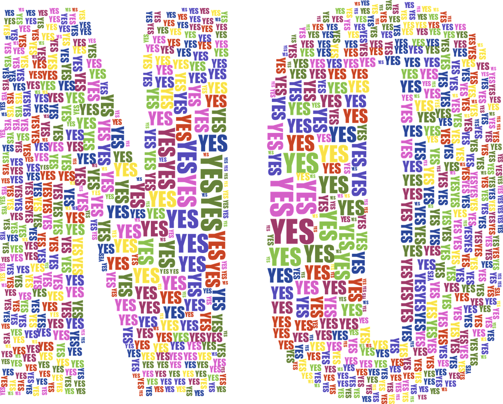

I have never been taught to say no when I was a kid nor I have ever thought to learn to say no for a long time. Perhaps, it happens with you too. I think it’s more common with people who are more empathetic than others.

“When you say yes to others, make sure you are not saying no to yourself.”
– Paulo Coelho

It’s about knowing yourself better than anyone else.

It’s about understanding what you want at the moment.

It’s about the peace of mind you can get when you are done with what you targeted for.

It’s not about saying no or yes to others but to things that you are surrounded by which are of little importance.

It’s about saying no to that trivial notification from your phone that can wait.

It’s about saying no to unwanted gossip which you are not part of.

It’s about saying no to that uncommitted work which holds negligible value in your life.

It’s about you, your choice and your life totally. And “Choice” is a privilege.

Once you made the choice, you have to live up with the consequences forever. Time is never going to expand nor wait for that moment to complete. Ask a man the value of time who have been diagnosed with a life-threatening disease and have been told that he has 5 years to live. And ask us who believes that there is ample amount of time for us not realizing anything can happen anytime.

This is what happens if we never say no

We will regret that one no could have handled that one wrong decision.
We will miss our committed targets.
We will be unhappy and unsatisfied.
We will waste our time on trivial things.
We won’t be able to say yes to the really important things.
We don’t have to be a Yes-Man just to be likable. It takes gut to listen to your heart and follow it but for the rest of your life, there will be no regrets.